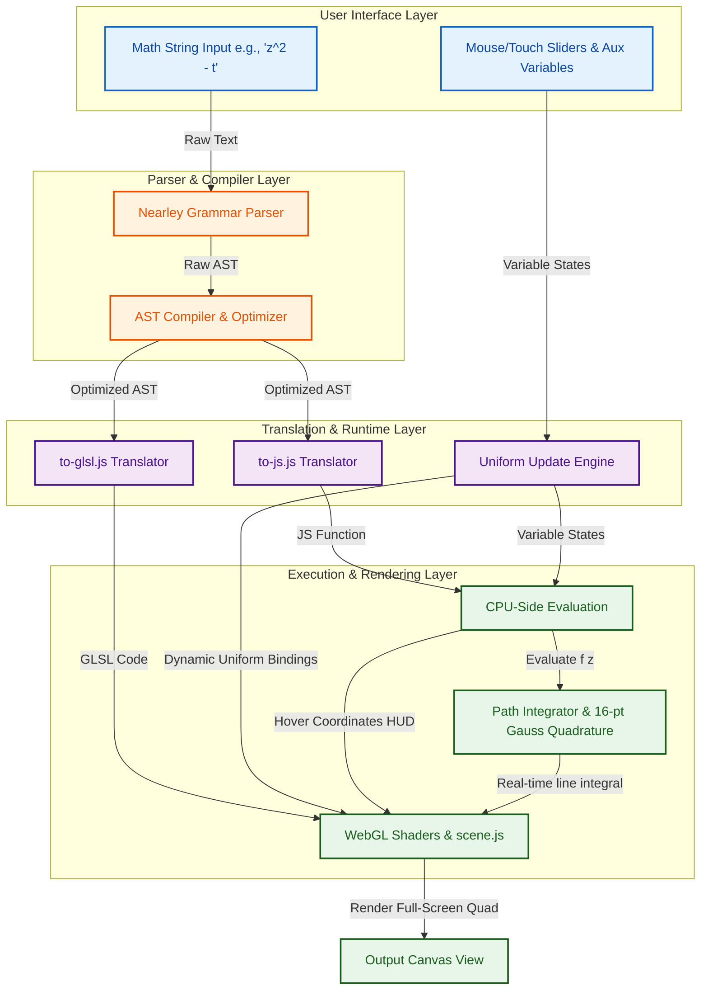

# Complex Function Plotter — Branch & Architectural Documentation

This document provides a comprehensive overview of the repository's structure, focusing on both the **Git branches** (development and deployment workflows) and the **codebase architectural branches** (the modular directory structure and functional components of the source code). It explains how they work, how data flows through the application, and the mathematical machinery driving the real-time domain-coloring plots and contour integrations.

---

## 1. Git Branches (Version Control Workflows)

The repository's version control workflow separates active development, automated dependency management, and production static site hosting through distinct branches:

| Git Branch | Type | Description |
| :--- | :--- | :--- |
| `master` | Core | The primary branch containing the active React application source code, WebGL shaders, compiler translators, and build scripts. All feature additions, bug fixes, and development take place here. |
| `gh-pages` | Deployment | The production branch that hosts the compiled static site assets. Running the deploy script (`npm run deploy` which invokes `gh-pages -d build`) builds the application and pushes the resulting static files to this branch, which are served live at [https://samuelj.li/complex-function-plotter](https://samuelj.li/complex-function-plotter). |
| `dependabot/npm_and_yarn/*` | Maintenance | Automated dependency update branches created by GitHub Dependabot to safely upgrade packages and maintain security standards. |

---

## 2. Codebase Architectural "Branches" (Directory Structure & Modules)

The source code of the repository is clean and highly modular, divided into two primary structural "branches" under `src/`:

```
complex-function-plotter/
├── config/                  # Ejected Webpack & Jest configuration settings
├── scripts/                 # Start, Build, and Test runners
├── public/                  # Static assets & index.html template
└── src/                     # Main source code directory
    ├── components/          # React User Interface layer & Panels
    └── gl-code/             # Parser, Compiler, and WebGL rendering pipeline
```

### A. The UI Module Branch (`src/components/`)

This branch contains the React stateful views, user controls, options panels, and interactive features:

*   **`App.js` (Core Orchestrator):** The master React component that holds the global application state. It manages the parsed expression abstract syntax tree (AST), auxiliary slider variables, menu/help panels, and synchronizes application state with the URL hash fragment to support shareable plot links.
*   **`ControlBar/`:** Contains `ControlBar.js` and its stylesheet. Renders the top input bar, allowing users to enter mathematical expressions (e.g., `z^2 - t`), showing immediate red syntax errors on parse failures, and housing the Help and Settings toggles.
*   **`SidePanel/`:** A collapsible, responsive sliding drawer containing option controllers, variable sliders, and custom shader editors.
*   **`SliderPanel/`:** Manages auxiliary variables dynamically.
    *   `SliderPanel.js`: Filters out hidden system variables and displays active auxiliary variables.
    *   `VariableSlider.js`: A slider control for real-time visualization of parameter changes.
    *   `VariableAdder.js`: Simple adder input to introduce new variables on the fly.
    *   `editable-value/`: Contains `EditableValue.js` which parses numeric entries supporting nice float values.
*   **`OptionsPanel/`:** Grouped checkboxes to control graphics options (checkerboard, inverting colors, continuous gradient HSL/HSV, axes display) and advanced options like switching to "Custom Function" (raw GLSL shader mode).
*   **`FunctionEditor/`:** Housing a custom code editor (`FunctionEditor.js`) powered by `prismjs` and `react-simple-code-editor` where users can write arbitrary procedural GLSL mapping functions directly for the GPU.
*   **`FunctionPlot/` (The Viewer):**
    *   `index.js`: Instantiates the WebGL context, coordinates mouse/touch drag events to pan the viewport, and intercepts scroll/pinch gestures to dynamically adjust the logarithmic zoom scale (`log_scale`).
    *   `CoordinateOverlay.js`: A HUD overlay rendered in the lower-right corner of the canvas. It evaluates the plotted function at the user's cursor location and formats the output into a beautifully typeset LaTeX formula using `react-katex`.
*   **`IntegralCalculator/` (Path Integrals):**
    *   `index.js`: An interactive overlay canvas that enables users to draw contours on the complex plane.
    *   `IntegralPanel.js`: Controller interface to select integration paths (Freeform, Closed Freeform, or Circle).
    *   `ResultTooltip.js`: Renders the computed line integral value in real-time adjacent to the cursor as the contour is drawn.
    *   `strategies/`: Contains implementation classes for various path integrations:
        *   `Strategy.js`: Base class for line integration strategies.
        *   `Circle.js`: Evaluates circle contour integrals by parameterizing the circle and integrating over $[0, 2\pi]$.
        *   `Freeform.js`: Accumulates complex line integrals incrementally between cursor-movement events as the user draws a freeform path.
        *   `FreeformClosed.js`: Closes the integration loop back to the start point upon mouse release.
        *   `util.js`: Contains numerical integration algorithms, featuring a **16-point Gaussian quadrature** engine.

---

### B. The WebGL & Parser Module Branch (`src/gl-code/`)

This branch contains the mathematical translation layer, mathematical expression parser, and WebGL rendering pipeline:

*   **`grammar.ne` & `grammar.js`:** The Nearley parser grammar and its compiled JavaScript bundle. It parses standard mathematical string inputs into Abstract Syntax Trees (ASTs), handling correct operator precedence, parentheses, and functions (e.g., trig, hyperbolic, gamma, zeta, elliptic).
*   **`complex-functions.js`:** A library of complex-analytic mathematical functions implemented in GLSL, along with dependency mapping to automatically inject required helper functions into the shader source during compilation.
*   **`shaders.js`:** Responsible for building and compiling the WebGL Vertex and Fragment shaders. It translates the mathematical AST into a complete fragment shader, featuring:
    1.  **Dual Coordinate Systems:** Supports standard Cartesian (`vec2`) and Log-Cartesian (`vec3`) coordinate representations.
    2.  **Supersampling:** Integrates 4-Rook supersampling (supersampling offset by diagonal grids) to ensure smooth, anti-aliased visual outputs.
    3.  **Anti-Moiré Logic:** Estimates the spatial derivative of the mapping function to dynamically fade out gridlines/checkerboards at high-frequency regions (such as poles or essential singularities).
*   **`scene.js`:** Initializes full-screen quad geometries, binds WebGL program variables, and updates uniform parameters on redraw triggers.
*   **`translators/` (AST Compilation & Target Translation):**
    *   `compiler.js`: Performs algebraic simplification, constant folding, canceled inverse function eliminations, and expansion of higher-order operators (e.g. `sum`, `prod`, `diff`).
    *   `derivative.js`: Analytically differentiates the AST with respect to a variable (using sum, product, quotient, and chain rules) and falls back to a central numerical finite-difference calculation if an analytical rule is missing.
    *   `to-glsl.js`: Translates the optimized AST into WebGL-compatible GLSL code, respecting the appropriate `vec2` or `vec3` numerical representation systems.
    *   `to-js.js`: Compiles the AST into executable JavaScript functions, allowing CPU-side computations like cursor coordinate evaluations and numerical path integrations.
    *   `custom-functions.js`: A CPU-side mathematical library implemented with `mathjs` to evaluate complex special functions (Gamma, Dirichlet eta, Riemann zeta, error function, Lambert W, Jacobi theta, Weierstrass elliptic, Jacobi elliptic sn/cn/dn, j-invariant, etc.) on the JavaScript side.

---

## 3. Data Flow & Execution Lifecycle

When a user interacts with the Complex Function Plotter, data flows seamlessly between the UI, the parsing/compilation engine, the WebGL GPU rendering pipeline, and the numerical CPU integration engine.

### ASCII Architectural Data Flow Diagram

```
+-----------------------------------------------------------------------------------+
|                                  USER INTERFACE                                   |
|   +--------------------------+                         +----------------------+   |
|   |  Math String Input       |                         | Mouse/Touch Sliders  |   |
|   |  (e.g., "z^2 - t")       |                         | (Auxiliary variable) |   |
|   +------------+-------------+                         +-----------+----------+   |
+----------------|---------------------------------------------------|--------------+
                 |                                                   |
                 v                                                   |
+----------------|--------------------+                              |
|           PARSER LAYER              |                              |
|   +------------v-------------+      |                              |
|   | Nearley Grammar Parser   |      |                              |
|   +------------+-------------+      |                              |
|                | (AST)              |                              |
|   +------------v-------------+      |                              |
|   | AST Compiler / Optimizer |      |                              |
|   +------------+-------------+      |                              |
+----------------|--------------------+                              |
                 | (Optimized AST)                                   |
                 v                                                   |
+----------------|---------------------------------------------------|--------------+
|                |              TRANSLATION & RUNTIME LAYER          |              |
|        +-------+-------+                                           |              |
|        |               |                                           |              |
|   +----v-----+    +----v-----+                                     |              |
|   | to-glsl  |    |  to-js   |                                     |              |
|   +----+-----+    +----+-----+                                     |              |
|        | (GLSL)        | (JS Eval Function)                        |              |
|        v               v                                           v              |
|   +----+-----+    +----+-----+                               +-----+----+         |
|   | WebGL    |    |  CPU-Side| <---[Coordinate HUD]--- <---  | Uniforms |         |
|   | Shaders  |    |  Eval    |                               | updates  |         |
|   +----+-----+    +----+-----+                               +-----+----+         |
|        |               |                                           |              |
|        |               v                                           |              |
|        |          +----+-----+                                     |              |
|        |          | Path     | <---[Drawing Contour UI]            |              |
|        |          | Integral |                                     |              |
|        |          +----+-----+                                     v              |
|        v               v                                           |              |
|   +----+---------------v-------------------------------------------+----------+   |
|   |                              RENDER & DISPLAY                             |   |
|   |     - GPU: Domain Coloring Grid (with 4-Rook Supersampling & Anti-Moiré)  |   |
|   |     - HUD: LaTeX z/f(z) coordinates                                       |   |
|   |     - Tooltip: Real-time path integration calculation                     |   |
|   +---------------------------------------------------------------------------+   |
+-----------------------------------------------------------------------------------+
```

### Mermaid Architectural Data Flow Diagram



---

## 4. Key Mathematical Algorithms & Performance Highlights

To achieve smooth, high-fidelity, and mathematically rigorous domain-coloring plots, the application employs several key computational optimizations and scientific techniques:

### I. Log-Cartesian Representation System (`vec3`)
Floating-point limits on the GPU (`1e-38` to `1e38` in WebGL single-precision floats) quickly cause overflows and underflows when visualizing extreme analytical behaviors (like the poles of the Gamma function or values near essential singularities).

To resolve this, the system implements an alternative `vec3` Log-Cartesian number system where a complex number $w = e^z(x+iy)$ is represented as:
$$\vec{u} = \left( \frac{x}{\|x+iy\|}, \frac{y}{\|x+iy\|}, z + \ln(\|x+iy\|) \right)$$
In this format, the first two coordinates represent a unit-length direction vector on the complex plane, and the third coordinate represents the natural logarithm of the magnitude. This expands the representable exponent range to over $\pm 10^{15}$, making it physically impossible to underflow or overflow the GPU buffers during calculation.

### II. 4-Rook Supersampling & Anti-Moiré Derivative Estimation
The fragment shader performs anti-aliasing and anti-Moiré operations concurrently using 4-Rook supersampling:
1.  **Supersampling:** It maps four diagonal pixel offsets ($+A, -A, +B, -B$).
2.  **Derivative Estimation:** It calculates the spatial derivative (the local stretch factor) by taking difference quotients of the mapped values across these four points.
3.  **Anti-Moiré:** If the local derivative is high (meaning colors or grid lines are changing faster than the display's Nyquist frequency), the shader automatically fades the checkerboard patterns and reduces saturation, blending them into a smooth, grey representation. This prevents the formation of misleading Moiré patterns.

### III. 16-point Gaussian Quadrature & Kahan Summation
Numerical line integration along arbitrary paths is calculated on the CPU:
$$\int_{\gamma} f(z) \, dz = \int_{a}^{b} f(\gamma(t)) \, \gamma'(t) \, dt$$
1.  **Gaussian Quadrature:** The interval is split, and each sub-segment is integrated using **16-point Gaussian quadrature**, which provides a highly accurate approximation using weighted function evaluations at specific Legendre-polynomial roots.
2.  **Kahan Summation:** To prevent round-off error accumulation over thousands of incremental mouse drawing events, the summation utilizes the Kahan algorithm. It carries a compensation variable to track and reintegrate lost low-significance bits back into the accumulator.

### IV. TeX rational identification (`checkKnown`)
The HUD overlay identifies if the real or imaginary component of a coordinate is close to a nice rational fraction of mathematical constants:
$$\text{Coordinates} \approx \frac{n \cdot C}{d} \quad \text{where } d \in \{1, 2, 3, 6, 12\} \text{ and } C \in \{\pi, e, \sqrt{2}\}$$
If true, it renders the formatted LaTeX representation (e.g. `\frac{5\pi}{6}`) instead of a decimal float, giving the plotter an exceptionally professional, math-native feel.
